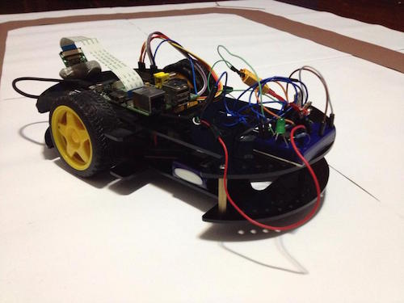

Autonomovel
===========

Autonomous car based on neural networks

Those are the source codes used in the creation of the autonomous car prototype. 
The car was controlled using a Raspberry Pi with a coupled camera and a wifi 
module used for the training part. 
